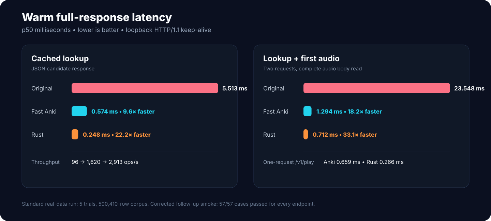
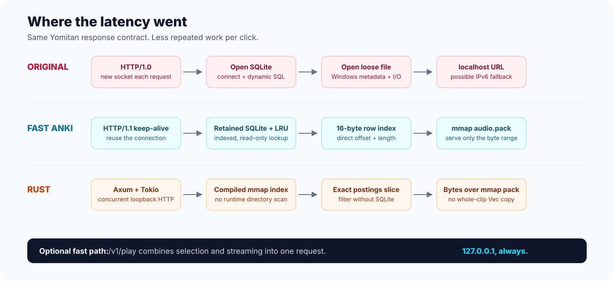

<p align="center">
  
</p>

<p align="center">
  <strong>A drop-in desktop replacement for the Yomitan Local Audio Server Anki add-on, plus an Anki-free Rust server.</strong>
</p>

<p align="center">
  <a href="#install--upgrade">Install</a> ·
  <a href="#use-it">Use it</a> ·
  <a href="#how-it-became-faster">How it works</a> ·
  <a href="#benchmarks">Benchmarks</a> ·
  <a href="#standalone-rust-server">Rust server</a> ·
  <a href="#troubleshooting">Troubleshooting</a>
</p>

<p align="center">
  
  
  <a href="LICENSE"></a>
</p>

## 18.2× faster in Anki. 33.1× faster with Rust.

Warm, full-response p50 latency on the same 590,410-row real-world collection:

| Workload | Original add-on | Fast Anki add-on | Standalone Rust |
|---|---:|---:|---:|
| Cached lookup | 5.513 ms | **0.574 ms — 9.6×** | **0.248 ms — 22.2×** |
| Lookup + first audio | 23.548 ms | **1.294 ms — 18.2×** | **0.712 ms — 33.1×** |
| One-request direct play | — | **0.659 ms** | **0.266 ms** |



The standard performance run used five repeated trials, real source and Forvo filters, and byte-checked audio from the copied collection. Its only top-level failure was an obsolete harness rule that rejected Rust's valid HTTP `416` response body; the corrected follow-up passed **57/57 cases for every endpoint**. See the [curated final benchmark note](benchmarks/results/FINAL.md) and [raw metrics](benchmarks/results/standard-20260811-metrics.csv).

## What this is

The original add-on does correct work, but it repeats expensive work on every click: open a connection, open SQLite, build a dynamic query, open one of hundreds of thousands of files, then close the HTTP connection.

Yomitan Audio Fast keeps the public contract and changes the hot path. Existing users keep the same add-on ID, port, `entries.db`, source priority, Forvo voices, candidate order, and audio bytes.

Choose one runtime:

| | Fast Anki add-on | Standalone Rust |
|---|---|---|
| Best for | Existing Local Audio Server users | Maximum speed without Anki |
| Yomitan-compatible JSON | Yes | Yes |
| Anki required while serving | Yes | No |
| Private bundle build | Automatic/manual in Anki | `compile` command |
| Measured lookup + audio p50 | 1.294 ms | 0.712 ms |
| Recommended port | `5050` | `5052` when Anki owns `5050` |

No audio, database, generated pack, executable, or private bundle is committed to this repository.

## Install / upgrade

### Existing Local Audio Server user — recommended

This is a same-ID replacement for add-on `1045800357`. The packaged `.ankiaddon` tells Anki to replace the old code while preserving its `user_files` automatically.

1. Download [`local-audio-fast.ankiaddon`](https://github.com/bee-san/yomitan-audio-fast/releases/latest/download/local-audio-fast.ankiaddon), or build it from a checkout:

   ```powershell
   .\anki-addon\build-code-only-package.ps1
   ```

2. In Anki, open **Tools → Add-ons → Install from file…** and choose it.
3. Restart Anki. Your existing database and audio are retained.

You can also use **Tools → Local Audio Server → Import existing audio collection…** and drop an old add-on folder, `user_files`, collection root, or recognized source folder onto the window. Browse uses the exact same validated path. Original files are never moved or deleted.

For development, a manual same-ID overlay still works:

```powershell
$addon = Join-Path $env:APPDATA 'Anki2\addons21\1045800357'
Copy-Item .\anki-addon\* $addon -Recurse -Force
```

Keep the existing `user_files` when using the manual method.

If the add-on finds a valid database and referenced audio but no valid pack, it schedules one background acceleration build for that data fingerprint. You can also choose:

**Tools → Local Audio Server → Import existing audio collection…**

The picker accepts an old add-on root, its `user_files` directory, a collection root, or one recognized source folder. It validates the database, remaps sources, and never moves or deletes the original audio.

> [!IMPORTANT]
> The first pack build is a one-time local job and can take minutes on a very large collection. The measured pack was 1.60 GiB. Loose originals remain available as a safe fallback, so allow roughly the referenced audio size in free space unless you import the already-verified Rust pack as an NTFS hardlink.

The build window shows exact row progress and a **Cancel** button. A cancellation checkpoints the completed pack/index data without changing the active pack. Opening the action again—or restarting Anki after an interrupted automatic build—resumes from that checkpoint without rereading audio that is already packed. Source metadata is rechecked before publication, so changed files trigger a clean rebuild instead of a mixed pack.

Tested end to end on Windows 11 with Anki 25.09.5 / CPython 3.13.5. Other desktop platforms are not yet part of the release evidence. Android and `android.db` are deliberately out of scope.

More detail: [Anki add-on guide](anki-addon/README.md).

## Use it

Add a **Custom JSON** audio source in Yomitan or another compatible client:

```text
http://127.0.0.1:5050/?term={term}&reading={reading}
```

Keep Anki open when using the add-on runtime.

Quick checks:

```text
http://127.0.0.1:5050/healthz
http://127.0.0.1:5050/v1/info
http://127.0.0.1:5050/?term=猫&reading=ねこ
```

Optional fast path for clients that can play a URL directly:

```text
http://127.0.0.1:5050/v1/play?term={term}&reading={reading}
```

Or configure a Yomitan Custom JSON source that returns only the first candidate:

```text
http://127.0.0.1:5050/v1/first?term={term}&reading={reading}
```

`/v1/first` skips source/user filtering and stops after the first candidate in
configured source order. Use the root endpoint when the complete candidate list,
per-request filters, or fallback candidates are needed.

`/v1/play` selects the highest-priority permitted recording and streams it in one request. It is intentionally `no-store`; returned versioned media URLs are immutable.

## How it became faster



### Fast Anki add-on

1. **Reuse the HTTP connection.** HTTP/1.1 keep-alive replaces HTTP/1.0 connection churn.
2. **Keep SQLite warm.** A bounded pool of immutable, query-only connections replaces open/close per request. Row and final-response LRUs absorb repeat lookups.
3. **Use the indexed query shape that won.** `reading IS NULL OR reading=?` preserved a 23.5 µs median while avoiding the 628.2 µs p95 of term-only SQL plus Python filtering.
4. **Turn row IDs into byte offsets.** Every database row resolves through one fixed 16-byte mmap record containing pack offset, length, and MIME type.
5. **Map one immutable audio pack.** Playback reads only the selected range instead of paying Windows filesystem overhead for a loose file on every request.
6. **Return numeric loopback URLs.** `127.0.0.1` avoids the roughly two-second IPv6 `localhost` fallback observed on this machine.
7. **Make rebuilds cheaper.** Database regeneration batches 8,192 rows and defers index creation, measuring 1.46× the original fixture throughput.

On 2,000 real recordings, loose-file open/read measured 314.1 µs p50; creating the mapped pack view measured 1.2 µs. End-to-end packed audio HTTP was **2.23× faster**. The pack is mapped lazily—the 1.60 GiB file is not loaded wholesale into RAM.

### Standalone Rust

The compiler pays expensive work once. It turns the database and source files into an immutable `lookup.bin` plus `audio.pack`; runtime does no SQLite query and no recursive source scan.

- The default sorted mmap index uses XXH3 plus a 65,537-entry fanout, then verifies the exact UTF-8 key bytes before accepting a match.
- Ordered postings preserve every source, voice, display name, filter, alias, and candidate.
- Axum/Tokio handles concurrent loopback HTTP.
- Audio responses own a `Bytes` view over the mmap instead of copying the whole clip into a new `Vec`.
- `mph` and `preload` remain selectable for machine-specific A/B testing; sorted is the current balanced/default live mode.

The project measured Python preload and custom mmap alternatives too. Full preload saved tens of microseconds but cost 5.76 seconds of startup and about 250 MiB. The custom Python mmap lookup added complexity without a material end-to-end win, so retained SQLite remained the add-on default. The full decision log is in [ATTEMPTS.md](ATTEMPTS.md).

## Standalone Rust server

Rust stable with the MSVC target is required. This repository ships source, not a compiled EXE or private audio bundle.

```powershell
git clone https://github.com/bee-san/yomitan-audio-fast.git
cd yomitan-audio-fast\rust-server
cargo test --release
cargo build --release

$addon = Join-Path $env:APPDATA 'Anki2\addons21\1045800357'
.\target\release\yomitan-audio-rs.exe compile `
  --addon-root $addon `
  --output ..\bundle `
  --pack-workers 8

.\target\release\yomitan-audio-rs.exe verify --bundle ..\bundle
.\target\release\yomitan-audio-rs.exe serve `
  --bundle ..\bundle `
  --host 127.0.0.1 `
  --port 5052 `
  --lookup-mode sorted `
  --asset-mode pack
```

Then use:

```text
http://127.0.0.1:5052/?term={term}&reading={reading}
```

The compile is intentionally offline and can take time on hundreds of thousands of files. Publication is atomic and versioned. See the [Rust guide](rust-server/README.md) for modes, verification, and API details.

## Benchmarks

Headline figures are warm steady-state full-response medians from the `standard` profile:

- AMD Ryzen AI Z2 Extreme, Windows 11, NVMe storage.
- 590,410 mappings, 280,396 terms, 373,911 referenced audio assets.
- Five sequential trials: 160 lookups, 40 two-stage operations, and 80 direct plays per trial.
- Real source subsets, ordering, omitted readings, aliases, misses, and Forvo user filters.
- Nearest-rank percentiles; pooled latency samples and median trial throughput.

Correctness was measured separately and aggressively:

- **743,634** exhaustive real-data selection cases, **0 mismatches**.
- Final corrected live smoke: **57/57** cases per endpoint.
- Standard run: **281/281** parity cases for the original and fast Anki paths, with **400 audio candidates byte-checked per endpoint**.
- Packed add-on soak: **2,064 requests**, 16 clients, **0 errors and 0 reconnects**.
- Add-on regression/lifecycle suite: **34/34** at repository handoff; Rust release tests: **4/4**.

Read the [final benchmark note](benchmarks/results/FINAL.md), [architecture experiments](ATTEMPTS.md), [raw standard metrics](benchmarks/results/standard-20260811-metrics.csv), or the broader [evidence archive](benchmarks/results/evidence-summary.md).

## Compatibility, privacy, and security

- Exact Yomitan `audioSourceList` envelope and candidate priority are preserved.
- `sources=` and Forvo `user=` filtering remain ordered and compatible.
- Stable versioned audio URLs support `GET`, `HEAD`, single byte ranges, ETags/304, exact lengths, CORS, immutable caching, and `nosniff`.
- Both servers bind only to numeric loopback by default; Rust rejects a non-loopback bind.
- Media URLs use opaque IDs, not arbitrary filesystem paths.
- There are no write endpoints and no arbitrary outbound fetch endpoint.
- Pack/index publication is versioned, bounded, integrity-checked, and collision-safe.
- Existing originals remain the fallback. The repository contains no private media or database payload.

The exact local data layout is documented in [DATA-LAYOUT.md](DATA-LAYOUT.md).

## Troubleshooting

### `healthz` does not respond

- Add-on runtime: confirm Anki is open and no other process owns port `5050`.
- Rust runtime: confirm `verify` succeeds and the bundle path is correct.
- Check the configured port in the add-on's `user_files/config.json`.

### JSON lookup works but audio does not play

- Use `127.0.0.1`, not `localhost`.
- Open `/v1/info` and confirm `audioPack` is present, or use **Tools → Local Audio Server → Show statistics**.
- If serving loose files, confirm the configured source roots still point to the original collection.

### The first build is taking a long time

That job reads and validates each referenced recording once. Its progress window shows processed rows, unique blobs, and missing files. You can cancel safely; run the action again or restart Anki to resume. Subsequent server starts open the immutable manifest/index instead of rescanning the collection.

### I already have audio somewhere else

Use **Tools → Local Audio Server → Import existing audio collection…**. Drop or browse to the folder. The importer accepts several common folder levels, validates `entries.db`, and leaves original audio in place.

## Repository map

- [`anki-addon/`](anki-addon/) — drop-in add-on, migration UI, pack builder, and tests.
- [`rust-server/`](rust-server/) — standalone compiler/server.
- [`benchmarks/`](benchmarks/) — parity harnesses, architecture matrices, and raw evidence.
- [`ATTEMPTS.md`](ATTEMPTS.md) — designs benchmarked and rejected/selected.
- [`DATA-LAYOUT.md`](DATA-LAYOUT.md) — shape of private/generated files omitted from Git.

## Contributing

Issues and focused pull requests are welcome. Please include the runtime you changed, a real compatibility case when relevant, and the smallest benchmark that demonstrates the effect.

Useful checks:

```powershell
# Rust
cd rust-server
cargo fmt --check
cargo test --release

# Add-on tests run under Anki's CPython in the development lab.
# The checked-in benchmark README documents the harness invocation.
```

Do not commit `user_files`, databases, audio, packs, indexes, bundles, executables, or bytecode. See [.gitignore](.gitignore).

## License

[MIT](LICENSE). The original add-on lineage and third-party notices are recorded in [NOTICE.md](NOTICE.md).
